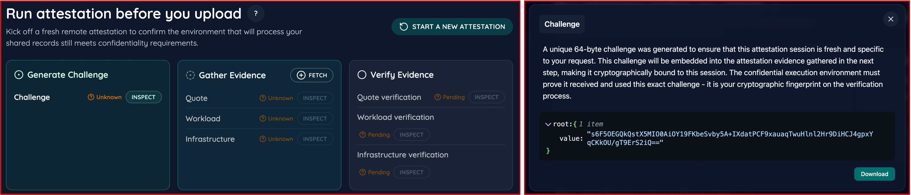
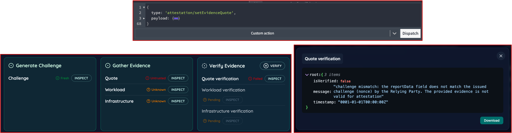
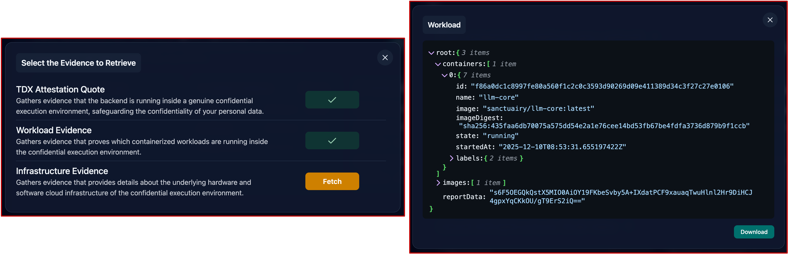
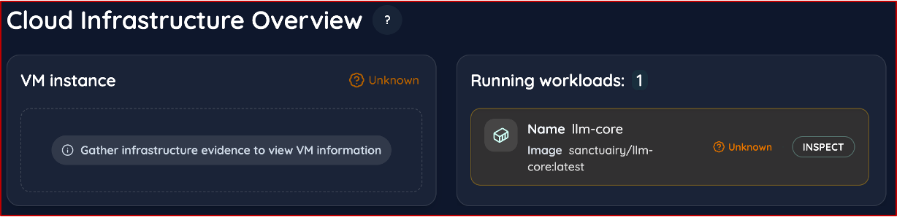
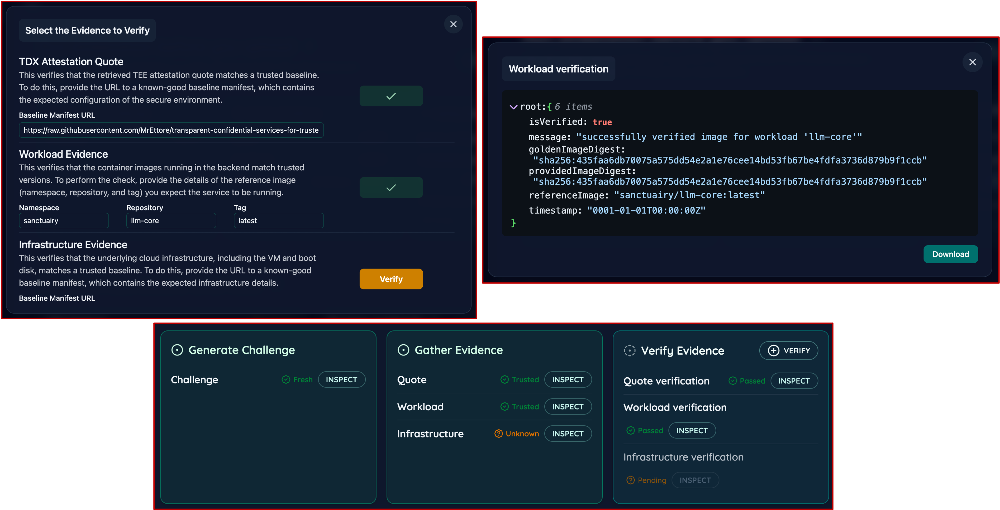
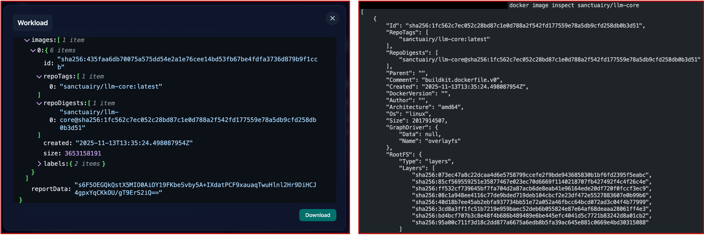
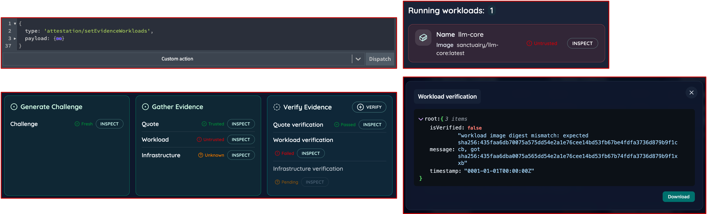
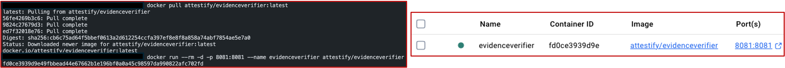
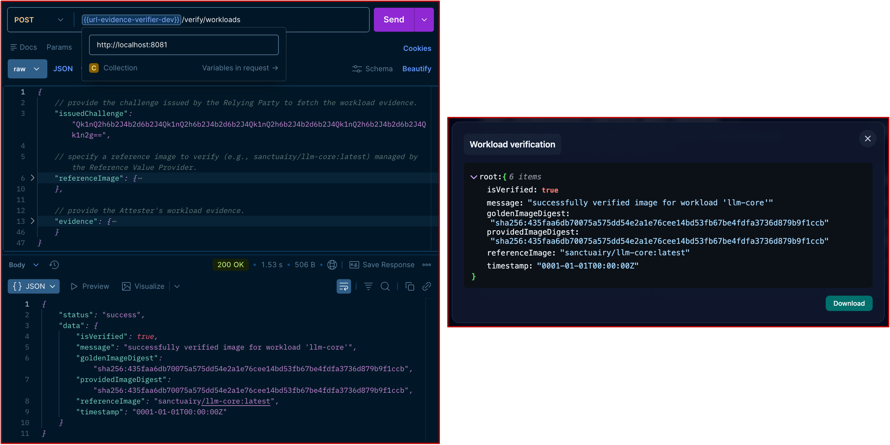
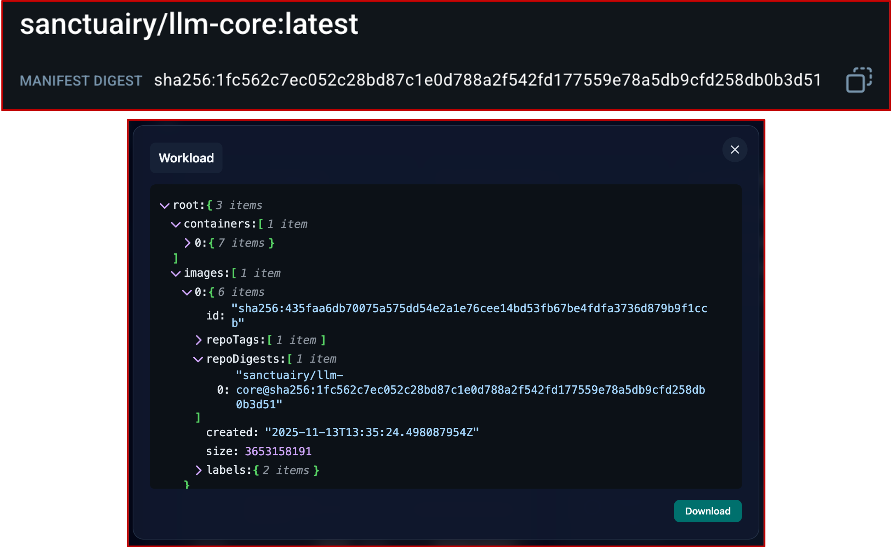

# Trustworthiness Security Assessment

This document extends the paper subsection "Trustworthiness Security Assessment" with a reproducible protocol for each assessed requirement. It enumerates the exact steps (positive path and negative control) executed during evaluation and includes screenshots illustrating the expected UI state and raw JSON artifacts to aid reproducibility and auditability.

## Repository Assets Used During Evaluation

- `artifacts/attestation-evidence/` - JSON payloads captured from live attestation rounds.
- `artifacts/attestation-result/` - Evidence Verifier outputs for the same rounds plus negative controls.
- `reference-value-provider/baseline-manifest.jsonc` - Public baseline manifest referenced by the Evidence Verifier.
- `relying-application/` - Self-contained React UI feature used to orchestrate nonce generation, evidence collection, and verification.
- `evidence-provider/` and `evidence-verifier/` - Service implementations that run inside the TEE and on the client respectively.

## Running the Attestation Experience (High Level)

1. Launch the Evidence Provider service inside the CVM and the Evidence Verifier in the auditor-controlled environment (i.e., the user's client) as described in their respective READMEs.
2. Run the Relying Application in the `relying-application/` folder. Ensure network connectivity to both services.
3. Navigate to the "Attestation" view. The `AttestationTimeline` component will guide you through challenge generation, evidence collection, and verification. Each step exposes modals that surface raw JSON artifacts.
4. Use the `CloudInfrastructureOverview` card to inspect infrastructure and workload metadata, and the `IndependentVerificationResources` section to fetch the public baselines and image digests used during verification.

The sections below extend the paper by capturing the exact protocol followed for each requirement, including negative controls.

## Req1: Session Authenticity (Freshness and Genuine TEE Binding)

**Objective:** Prove that every attestation exchange is fresh and tied to a genuine Intel TDX quote carrying the client challenge.

**Relevant artifacts:**

- Attestation Quote Evidence: [artifacts/attestation-evidence/attestation-quote-evidence.json](../../artifacts/attestation-evidence/attestation-quote-evidence.json)
- Verifier result: [artifacts/attestation-result/quote-attestation-result/pass.json](../../artifacts/attestation-result/quote-attestation-result/pass.json)
- Negative controls: [artifacts/attestation-result/quote-attestation-result/fail-nonce-mismatch.json](../../artifacts/attestation-result/quote-attestation-result/fail-nonce-mismatch.json), [artifacts/attestation-result/quote-attestation-result/fail-mrTd-mismatch.json](../../artifacts/attestation-result/quote-attestation-result/fail-mrTd-mismatch.json)

**UI surfaces:**

- `AttestationTimeline` steps "Generate Challenge", "Gather Evidence", and "Verify Evidence"
- `ViewChallenge` and `ViewEvidence` modals for nonce and quote inspection
- `ViewVerificationResult` modal for verdict details

**Prerequisites:**

1. Evidence Provider deployed inside the TDX-enabled CVM and reachable from the relying application
2. Evidence Verifier running locally on the client.

**Positive-path procedure:**

1. We click "Start Attestation" and then "Generate" in the "Generate Challenge" step to mint a fresh 64-byte nonce. The generated quote can be inspected by clicking the "Inspect" button.

   
   _Figure 1. Challenge generation in the AttestationTimeline after minting a fresh nonce._

2. We move to "Gather Evidence" and request a TDX Attestation Quote bound to the nonce we just created.
3. We press "Inspect" to open the `ViewEvidence` modal and confirm that the quote `reportData` echoes our nonce.

   
   _Figure 2. Quote evidence modal showing the nonce echoed in the `reportData` field._

4. We proceed to "Verify" under the "Verify Evidence" step and provide the baseline manifest URL surfaced in `IndependentVerificationResources`.
5. We review the quote verification verdict, ensuring the trust badge flips to "Trusted" and the JSON output matches `quote-attestation-result/pass.json`.

   
   _Figure 3. Quote verification result and trust badges confirming a successful appraisal._

**Expected outcome:**

- `reportData` equals the challenge;
- Verifier returns `isVerified: true` with a timestamp matching the session.

**Negative control (replay or tampering):**

1. We reopen the attestation page, launch the browser dev tools, and dispatch a previously captured TDX quote directly into the Redux store to simulate replaying stale evidence (action type: 'attestation/setEvidenceQuote').
2. We trigger quote verification with the current challenge still set to the previously generated nonce, causing the verifier to compare mismatched values.
3. We observe the verifier returning `isVerified: false` with a nonce mismatch message, matching `fail-nonce-mismatch.json`, and optionally repeat after editing the stored quote's `mrTd` to reproduce `fail-mrTd-mismatch.json`.

   
   _Figure 4. Replay attempt rejected with a nonce mismatch verdict in the UI._

## Req2: Computational Integrity (Workload-to-Source Binding)

**Objective:** Demonstrate that the workload running inside the CVM matches the container digest published in the public image registry.

**Relevant artifacts:**

- Workload Evidence: [artifacts/attestation-evidence/workload-evidence.json](../../artifacts/attestation-evidence/workload-evidence.json)
- Verifier result: [artifacts/attestation-result/workload-attestation-result/pass.json](../../artifacts/attestation-result/workload-attestation-result/pass.json)
- Negative control: [artifacts/attestation-result/workload-attestation-result/fail-digest-mismatch.json](../../artifacts/attestation-result/workload-attestation-result/fail-digest-mismatch.json)

**UI surfaces:**

- `AttestationTimeline` steps "Generate Challenge", "Gather Evidence", and "Verify Evidence"
- `CloudInfrastructureOverview` -> `WorkloadsSummary` with `WorkloadContainer` entries (UI section: "Running workloads")
- `ViewEvidence` modal for workload metadata. `ViewVerificationResult` modal for digest comparison output

**Prerequisites:**

1. Successful completion of the Session Authenticity positive path (fresh nonce still in scope)
2. Reference digest published in the registry and visible via `IndependentVerificationResources`

**Positive-path procedure:**

1. We keep the fresh nonce active and trigger "Fetch Workload Evidence", inspecting the JSON payload to ensure the evidence carries an `imageDigest` and `reportData` field.

   
   _Figure 5. Workload evidence fetched with container digests bound to the active nonce._

2. We go to `CloudInfrastructureOverview` to cross-check that the listed containers align with the evidence payload.

   
   _Figure 6. Cloud Infrastructure Overview listing the running workloads inside the TEE._

3. We start "Verify Workload", reusing the same challenge and selecting the expected registry image (namespace, repository, tag).
4. We confirm that the verifier resolves the canonical digest from the registry, compares it to the reported digest, and we archive the success output (mirrors `workload-attestation-result/pass.json`).

   
   _Figure 7. Workload verification response confirming the reported digest matches the registry._

5. We optionally validate independently by pulling the referenced image locally and inspecting it (`docker image inspect sanctuairy/llm-core`) to corroborate the hash.

   
   _Figure 8. Independent `docker image inspect` corroborating the published workload digest._

**Expected outcome:**

- `reportData` equals the challenge;
- Reported digest equals the registry digest;
- Verifier returns `isVerified: true` and surfaces both `goldenImageDigest` and `providedImageDigest` fields (identical).

**Negative control (digest mismatch):**

1. We reopen the attestation page, open the browser dev tools, and dispatch the Redux action `attestation/setEvidenceWorkloads` with a previously captured evidence payload whose `imageDigest` we manually altered.
2. We trigger the "Verify Workload" step, leaving the issued challenge untouched so the verifier compares the tampered digest against the golden registry value and returns `isVerified: false`, mirroring `fail-digest-mismatch.json`.

_Figure 9. Workload verification failure triggered by dispatching a tampered digest._

## Req3: Protocol Validity (Independent, Reproducible Appraisal)

**Objective:** Show that the verification outcome can be reproduced outside the confidential service provider boundary using only public artifacts and the published Evidence Verifier image.

**Relevant artifacts:**

- Evidence bundle: [artifacts/attestation-evidence/](../../artifacts/attestation-evidence/)
- Baselines: [reference-value-provider/baseline-manifest.jsonc](../../reference-value-provider/baseline-manifest.jsonc) and registry digests referenced in the UI
- Verifier results: [artifacts/attestation-result/](../../artifacts/attestation-result/) (`*/pass.json`)
- Negative controls: [artifacts/attestation-result/](../../artifacts/attestation-result/) (`*/fail-*.json`)

**UI surfaces:**

- `IndependentVerificationResources` card linking the verifier container image and baseline manifests
- `ViewVerificationResult` modal showing deterministic verification outputs

**Prerequisites:**

1. Access to a machine controlled by the evaluator with Docker available
2. Network access to pull and view the verifier container image and baseline manifest from the public registry/GitHub
3. Access to the attestaion evidence JSON files captured from the positive-path runs

**Positive-path procedure:**

1. We pull the verifier image pinned in the UI (`docker pull attestify/evidenceverifier:latest`).
2. We launch the container locally, exposing port 8081 (`docker run --rm -d -p 8081:8081 --name evidenceverifier attestify/evidenceverifier`).

   
   _Figure 10. Evidence Verifier container pulled and started locally on port 8081._

3. We invoke the verifier’s HTTP endpoints (e.g., via `curl` or Postman) using the evidence JSON captured through the relying application:
   - `/verify/tdx-quote` with the issued challenge, url of the baseline manifest, and the quote payload;
   - `/verify/workloads` with the the issued challenge, workload evidence, and registry reference;
   - `/verify/infrastructure` with the the issued challenge, infrastructure evidence and baseline manifest url.
4. We compare each JSON response with the corresponding pass artifacts in `artifacts/attestation-result/*/pass.json`, confirming field-level equality with the UI’s verification outputs.

   
   _Figure 11. Local verifier responses compared against pass artifacts from relying application UI for equivalence._

5. We restart the container (`docker restart evidenceverifier`) or run it afresh, reissue the same requests, and verify the verdicts remain identical, demonstrating stateless appraisal.
6. We cross-check the confidential workload reference by comparing the `repoDigests` field from the workload evidence with the manifest digest published on GitHub (linked in the UI’s Independent Verification Resources).

   
   _Figure 12. Repo digest from workload evidence matched against the GitHub manifest digest._

**Expected outcome:**

- Verifier container runs purely from public inputs and produces the same pass verdicts;
- No hidden state is required (identical results after restart);
- UI continues to show transparent links to every artifact consumed.

**Negative control (replay with tampered evidence):**

1. We pick one of the negative control artifacts (e.g., `quote-attestation-result/fail-nonce-mismatch.json`) or manually corrupt the evidence before replaying it locally.
2. We rerun the verifier container and confirm it exits with a failure status or emits `isVerified: false`, mirroring the online negative control results.
