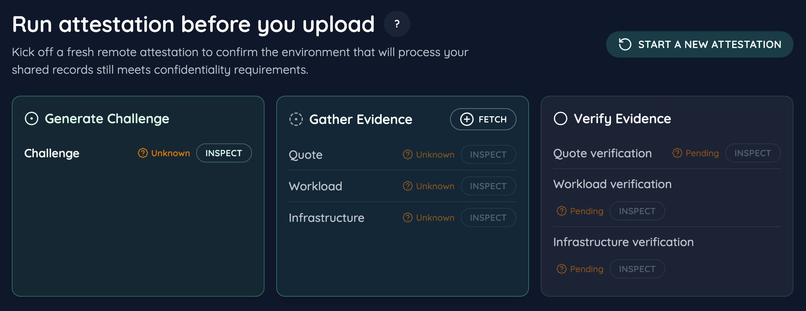
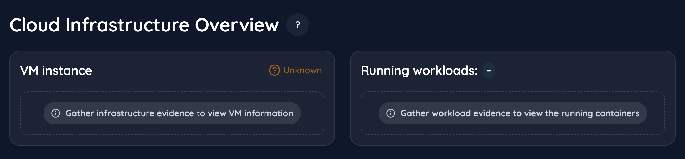
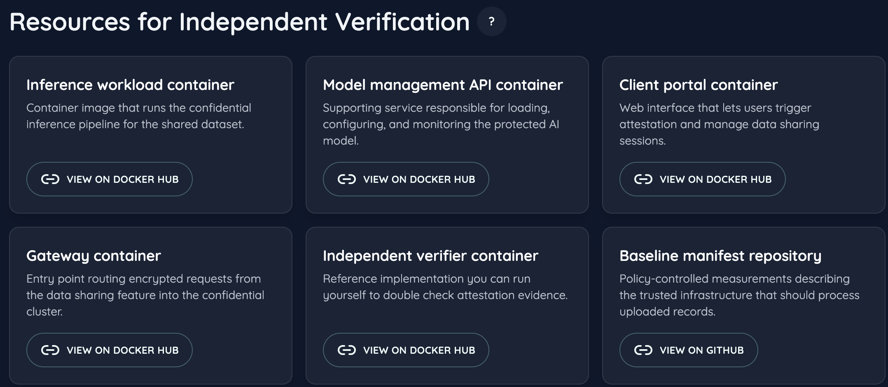

# Relying Application - Attestation UI Walkthrough

The relying application is a React + TypeScript single-page experience that lets end users orchestrate the full attestation round-trip before sharing sensitive data. This guide focuses on the attestation feature (`src/features/attestation`) and explains how the UI surfaces the challenge generation, evidence collection, and verification phases defined in the paper.

## Attestation Experience Overview

The attestation page layers three complementary surfaces that keep the user oriented across protocol execution and post-verification transparency.

- `AttestationTimeline` orchestrates the core attestation protocol: generating a client-side nonce, gathering quote/workload/infrastructure evidence, and submitting those bundles for verification through the modal system.
- `CloudInfrastructureOverview` presents the attested runtime once evidence arrives, summarizing VM metadata and container inventory with drill-down inspectors for disks, instance identity, and per-container JSON.
- `IndependentVerificationResources` curates external artifacts so auditors can reproduce the attestation independently, including container images, verifier binaries, and baseline manifests.

The following sections break down how the main parent components visualize each attestation stage.

## `AttestationTimeline`

`AttestationTimeline` renders the stepper overview of the attestation protocol and wires modal actions to the attestation Redux slice.

- **Header & Status Surface:** the `Header` component summarizes the protocol, while `AttestationStep` cards show real-time status (idle, in-progress, done) for each phase. A trust badge appears once verification succeeds.
- **Inline Actions:** each card exposes a primary CTA (`Generate`, `Fetch`, `Verify`) that opens the appropriate modal (`GenerateChallenge`, `FetchEvidence`, `VerifyEvidence`). These modals drive the network requests and dispatch slice actions.
- **Artifact Inspection:** secondary buttons open detail viewers:
    - `ViewChallenge` shows the raw nonce and hex representation.
    - `ViewEvidence` renders syntax-highlighted JSON for quotes, workload inventories, or infrastructure metadata. For large payloads the component supports expand/collapse affordances.
    - `ViewVerificationResult` lists the verdict, timestamps, matching digests, and links back to reference baselines.
- **Freshness Tracking:** `computeChallengeFreshness` runs on every render to flag reused or stale challenges, reinforcing the nonce requirement described in the paper.

_Figure 1. Timeline stepper with modal entry points for challenge, evidence, and verification phases._

## `CloudInfrastructureOverview`

`CloudInfrastructureOverview` presents the attested runtime environment once evidence has been gathered. It is composed of two stacked cards.

### `InfrastructureSummary`

- **Trusted Metadata Panel:** renders key/value pairs for the VM (instance ID, region, TDX enablement, CPU platform) with contextual coloring based on `TrustStatusBadge`.
- **Deep-Dive Modals:** `Inspect disk` triggers `ViewInstanceDisk`, exposing boot disk provenance and image digests. `Inspect VM` opens `ViewInstanceIdentity` to show the full GCP instance document.
- **Empty State Messaging:** when evidence is missing, the panel instructs users to gather infrastructure evidence first.

### `WorkloadsSummary`

- **Container Inventory:** lists each running container, image digest, creation time, and OCI labels via `WorkloadContainer` tiles. Tapping a tile launches the `ViewContainer` modal with full JSON.
- **Scrollable Layout:** supports long container lists while preserving context for the summary header and trust badges.

_Figure 2. Cloud infrastructure overview highlighting VM trust status and workload inventory inspectors._

## `IndependentVerificationResources`

This section equips users (or auditors) with links to reproduce attestation independently.

- **Resource Grid:** `VerificationResource` cards highlight container images, verifier binaries, and baseline manifests. Each card includes a concise description and external link.
- **Extensible Layout:** easily extend the grid with additional artifacts such as policy documents or signed SBOMs.

_Figure 3. Resource grid linking reference containers, verifier binaries, and baseline manifests for independent review._

## Additional UI Capabilities

- **Session State Management:** the attestation slice persists the current challenge, evidence bundles, and verification results so that users can revisit artifacts without re-running the flow.
- **Modal System:** shared `Modal` and `ModalType` definitions ensure a consistent look, keyboard accessibility, and straightforward extension for new artifact viewers.
- **Trust Badges:** `TrustStatusBadge` communicates verification results at-a-glance, switching between trusted, untrusted, and pending states.
- **Timeline Reset Hooks:** the slice exposes actions to clear evidence or restart attestation, making it simple to demonstrate replay protection during live talks.
